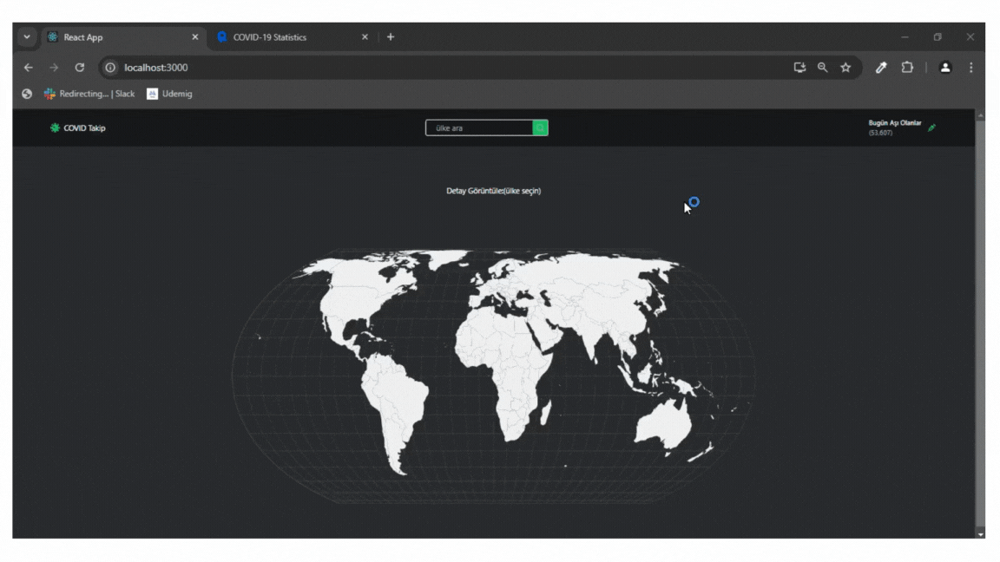

## CovidMap

- Bu proje, COVID-19 pandemisi sırasında güncel vaka verilerini görselleştirmek amacıyla geliştirilmiş bir harita uygulamasıdır. Uygulama, dünyanın çeşitli bölgelerindeki vaka sayılarını, ölüm oranlarını ve iyileşme oranlarını interaktif bir şekilde sunar. Uygulamanın güvenilirliği ve doğruluğu, kapsamlı unit testler ile sağlanmıştır. 

### Özellikler 

- Güncel Veri: Üçüncü taraf bir API üzerinden sürekli güncellenen gerçek zamanlı COVID-19 verileri.

- İnteraktif Harita: Kullanıcıların farklı bölgeleri büyütüp küçülterek detaylı bilgiye ulaşabileceği interaktif bir dünya haritası.

- Vaka İstatistikleri: Toplam vaka sayısı, aktif vaka sayısı, iyileşen hasta sayısı ve ölüm sayısı gibi detaylı istatistikler.

- Unit Testler: Uygulamanın tüm önemli fonksiyonlarının doğru çalıştığını garanti eden kapsamlı unit testler.

### Kütüphaneler 

- react-router-dom
- react-icons
- tailwind
- react-simple-maps
- @reduxjs/toolkit
- react-redux
- @testing-library/user-event@14.0
- axios@^0.27.2
- react-testing-library
- jest

### Kaynaklar 

- 1.API (Covid Verisi) : https://rapidapi.com/axisbits-axisbits-default/api/covid-19-statistics/playground/apiendpoint_db674dc9-a1dc-4f86-97fe-328bfeb20e9c 

- 2.API (Ülke Bilgileri) : https://restcountries.com/ 

### Gif 

